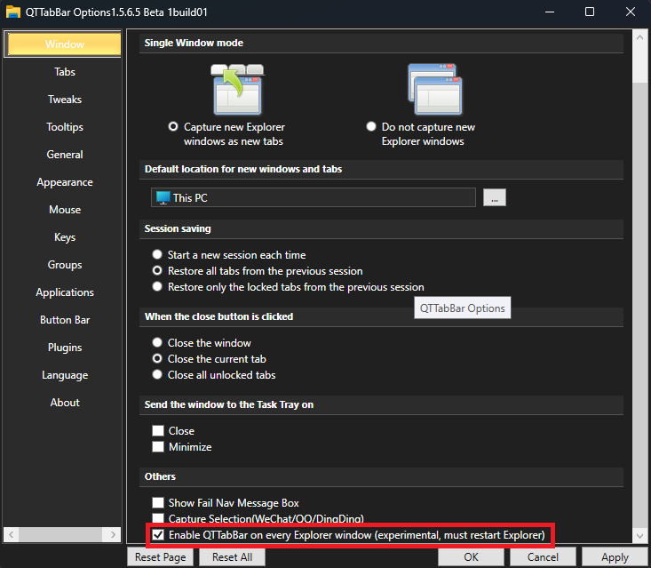

- [QTTabBar Document](https://www.yuque.com/indiff/qttabbar/zqtdig)
- [汉化GitHub modify by indiff](https://openuserjs.org/scripts/indiff/GitHub_%E6%B1%89%E5%8C%96%E6%8F%92%E4%BB%B6_(indiff)%E4%BF%AE%E6%94%B9)
- [Generate chm db document(Support Group By Module) modify by indiff](https://github.com/indiff/DBCHM)

[](https://sourceforge.net/projects/qttabbar2/files)
[](https://github.com/indiff/qttabbar/releases)
[](https://github.com/indiff/qttabbar)
[](https://gitee.com/qwop/qttabbar)
[](https://dotnet.microsoft.com/download/dotnet-framework/net48)

QTTabBar adds tabbed browsing and other enhancements to Windows Explorer. This is a fork of [indiff/qttabbar](https://github.com/indiff/qttabbar), updated for .NET 4.8 and modern Windows.


1. Qttabbar domestic optimized version is based on sf.net/projects/qttabbar/ (2012-06-17). The original author of this version has not released it. I don't know why. Adding some Chinese features is mainly for the convenience of domestic users; in addition, the capture window of quizo official website maintained by Japanese authors is not used to all the time, so this version retains the easy-to-use function of capture window.
2. Qttabbar is a small tool that allows you to use tab multi label function in Windows Explorer. Since then, there are no windows folder and awesome folder preview functions, which greatly improves the efficiency of your work. It's like IE 7, and it's like Firefox and opera. Qttabbar also provides some plug-ins, such as file operation tool, tree directory, display status bar and so on.
3. [Install qttabbar Windows11](https://github.com/indiff/qttabbar/wiki/Windows11%E5%AE%89%E8%A3%85qttabbar)
4. [Dark Mode for Windows11](https://github.com/StickySli/qttabbar-dark-mode-skin)
- [GitHub Mirror](https://indiff.github.io/qttabbar)
- [Gitee Mirror](https://gitee.com/qwop/qttabbar)
- [SourceForge Mirror](https://sourceforge.net/projects/qttabbar2/)
## Changes

- [1.5.6.2 (2026)](https://github.com/indiff/qttabbar/releases/tag/v1.5.6.2) Upgrade to .NET 4.8; fix options dialog crash and empty window; bars disabled by default; installer restarts Explorer correctly
- [1.5.6.1-beta (2024)](https://github.com/indiff/qttabbar/releases/tag/v1.5.6.-beta.1) Fix auto select
- [1.5.5.9-beta (2023)](https://github.com/indiff/qttabbar/releases/tag/v1.5.5-beta.9) Capture to select, fix preview text encoding
- [1.5.5.8-beta (2022)](https://github.com/indiff/qttabbar/releases/tag/v1.5.5-beta.8) No Plugins Mini Version
- [1.5.5.7-beta (2022)](https://github.com/indiff/qttabbar/releases/tag/v1.5.5-beta.7) Dark mode support, background image support
- [1.5.5.6-beta (2022)](https://github.com/indiff/qttabbar/releases/tag/v1.5.5-beta.6) Added Brazilian, Spanish, French, Turkish languages
- [1.5.5.5-beta (2022)](https://github.com/indiff/qttabbar/releases/tag/v1.5.5.5-beta) Debug log, DPI adjustment
- [1.5.5.4-beta (2022)](https://github.com/indiff/qttabbar/releases/tag/1.5.5.4-beta) Ignore control panel capture
- [1.5.5.3-beta (2021)](https://github.com/indiff/qttabbar/releases/tag/v1.5.5.3) SetHome tool, Portuguese (Brazil)
- [1.5.5.2-beta (2021)](https://github.com/indiff/qttabbar/releases/tag/1.5.5.2-beta) Built-in German, fix version number
- [1.5.5 (2021)](https://github.com/indiff/qttabbar/releases/tag/1.5.5.1-beta) Fix Explorer crash on options open, mouse hover activation plugin
- [1.5.4 (2021)](https://github.com/indiff/qttabbar/releases/tag/1.5.4-beta) All plugins built-in, fix lock function bug
- [1.5.3 (2020)](https://github.com/indiff/qttabbar/releases/tag/1.5.3-beta) Custom button images, clipboard path in new tab, video preview
- [1.5.2 (2020)](https://github.com/indiff/qttabbar/releases/tag/1.5.2) Fix command prompt exception, exception log improvements
- [1.4 (2020)](https://github.com/indiff/qttabbar/releases/tag/1.4) Fix hotkey conflicts, create empty file
- [1.3](https://github.com/indiff/qttabbar/releases/tag/1.3) Plugin deduplication and sorting
- [1.2](https://github.com/indiff/qttabbar/releases/tag/1.2) Windows 10 support, fix link failures
- [1.1](https://github.com/indiff/qttabbar/releases/tag/1.1) Localized installer UI
- [1.0](https://github.com/indiff/qttabbar/releases/tag/1.0) Built-in Chinese language

## Download

* [qttabbar Latest version](https://github.com/indiff/qttabbar/releases)
* [qttabbar Chinese mirror](https://gitee.com/qwop/qttabbar/releases)
* [](https://sourceforge.net/projects/qttabbar2/files/latest/download)

## Installation

1. Run `QTTabBar Setup.exe` — it will install .NET Framework 4.8 automatically if not present
2. After installation, open a File Explorer window
3. Activate QTTabBar — the steps differ by Windows version (see below)

### Activating on Windows 10

Explorer still has a classic toolbar, so enable the bands the normal way: right-click an empty part of the toolbar area (or use **View → Options**) and tick **QTTabBar** and **QT ButtonBar**. This gives the full experience, including QTTabBar's own tab bar.

### Activating on Windows 11

Windows 11 removed the classic Explorer toolbar, so there's no toolbar menu to enable QTTabBar through. Instead, turn on the auto-attach option:

1. Right-click an empty area inside any folder and choose **QTTabBar Options**.
2. On the **Window** tab, tick **“Enable QTTabBar on every Explorer window (experimental, must restart Explorer)”**.
3. Click **OK**, then restart Explorer — either sign out and back in, or open Task Manager, find **Windows Explorer**, and click **Restart**.



On Windows 11, QTTabBar works alongside Explorer's own native tabs rather than showing its own tab bar. Once enabled you get:

- **Double-click** an empty area of a folder to go up one level
- **Hover previews** of text files and photos/media files

Error logs are written to `%APPDATA%\QTTabBar\QTTabBarException.log`.

## Build

**Requirements:**
- Visual Studio 2022
- [WiX Toolset v3.14](https://github.com/wixtoolset/wix3/releases) (command-line tools)
- [NotifyPropertyWeaver](https://github.com/SimonCropp/NotifyPropertyWeaver) (included in `Tools\`)

**Day-to-day code changes** (no installer needed):

```powershell
msbuild QTTabBar\QTTabBar.csproj /p:Configuration=Release /p:SolutionDir="$pwd\\"
```

**Cutting a versioned release installer:**

```powershell
.\Installer\Build-Installer.ps1 -Version 1.5.6.4
```

This is the *only* place the version number needs to be typed — the script stamps it into `AssemblyInfo.cs`, `Installer.wxs`, and `Bundle.wxs`, then builds the DLL, MSI, and bootstrapper. (`QTUtility.CurrentVersion`, shown in the About tab, reads the version from the built assembly at runtime instead of being hardcoded separately.)

Output: `Installer\bin\Release\QTTabBar Setup <version>.exe` (bootstrapper with embedded MSI)

# QQ Group
* Group: [157604022](https://qm.qq.com/cgi-bin/qm/qr?k=fPZlN22xK_Y7NU60ZGMm8gIjH_u_8PVE&jump_from=webapi)
* Group2: [963211351](https://jq.qq.com/?_wv=1027&k=VCPD2zLH)

## Thanks

* [Original author Quizo](https://twitter.com/QTTabBar)
* [indiff](https://github.com/indiff/qttabbar) — upstream fork maintainer
* [SF Version Author](https://sourceforge.net/u/masamunexgp/profile)
* [Donation List](https://github.com/indiff/qttabbar/wiki/Thanks-%E9%B8%A3%E8%B0%A2%E6%8D%90%E5%8A%A9)
* [Donation](https://www.paypal.com/cgi-bin/webscr?cmd=_s-xclick&hosted_button_id=7YNCVL5P9ZDY8)
* Recruit volunteers for a long time and send an email to indiff@126.com Or add wechat adgmtt
# Thanks for free JetBrains Open Source license

<a href="https://www.jetbrains.com/?from=QtTabBar" target="_blank">
</a>

# Wechat Group
<table>
    <tr>
        <td>Invitation to wechat group</td>
        <td></td>
    </tr>
</table>
